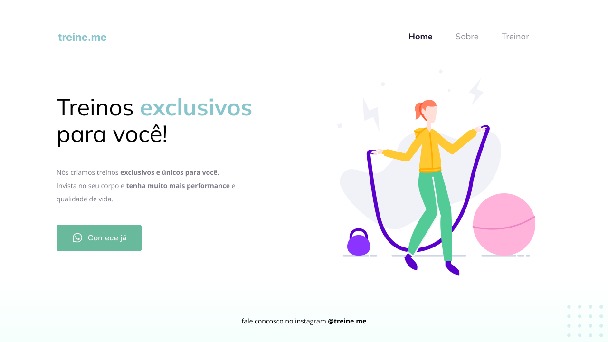

<h1 align="center">Página simples</h1>

Uma página simples para treinar conceitos de box model, display flex, position e responsividade.

 

<a href="https://www.figma.com/file/ruvo5VTGOzqylpdERY6V2C/Explorer---Projeto-02-(Copy)?node-id=1%3A5">Layout do projeto</a>

Tecnologias utilizadas:
 HTML e CSS
 Git e GitHub

